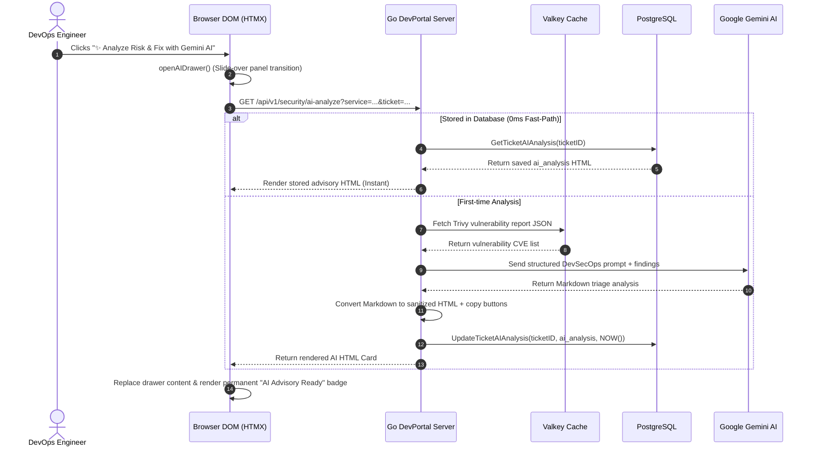
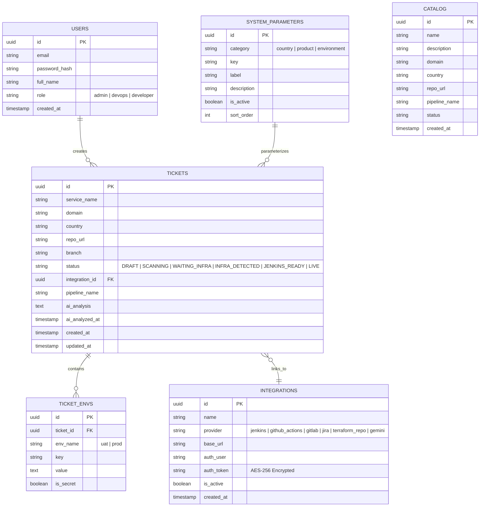
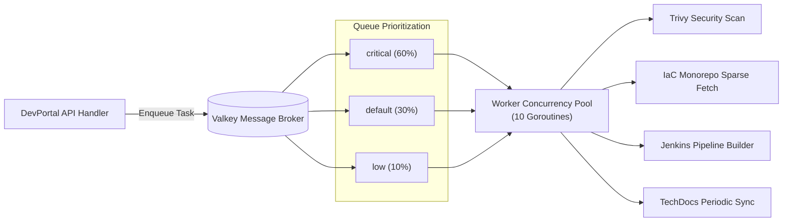
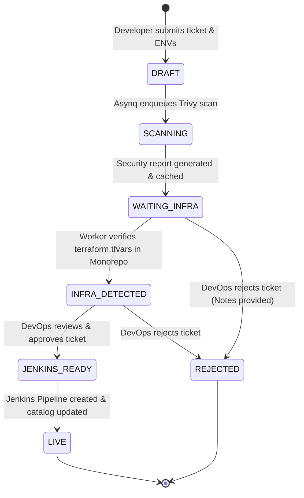

# System Architecture & Technical Design Document (SYSTEM_DESIGN.md)

**System Name:** Oona Developer Portal & Service Catalog (IDP)  
**Organization:** Oona Insurance  
**Document Version:** 2.0 (Production-Ready Architecture)  
**Last Updated:** September 2026  

---

## 1. Executive Summary & Problem Statement

### 1.1 Overview
The **Oona Developer Portal** is an enterprise-grade Internal Developer Platform (IDP) and automated microservice onboarding orchestration engine. It unifies service discovery, continuous security scanning, infrastructure-as-code (IaC) verification, automated CI/CD pipeline generation, and AI-assisted vulnerability remediation into a single pane of glass.

### 1.2 Core Objectives
1. **Self-Service Onboarding:** Enable software engineers across Oona regional entities (e.g., PH, ID, VN, TH, SG, MY) to register services with standardized configurations.
2. **Automated IaC & Governance Gate:** Eliminate manual parameter synchronization between developers and DevOps by automatically detecting Terraform topologies in `oona-dtc-country-terraform-iac`.
3. **Continuous Shift-Left Security:** Automatically scan source code and dependencies using Trivy, with live telemetry integrated into the executive dashboard and approval gate.
4. **AI-Powered DevSecOps Triaging:** Empower DevOps engineers with single-click Gemini AI security risk assessments, blast radius evaluations, and copy-paste remediation commands.
5. **Zero-Overhead Hypermedia Architecture:** Deliver real-time interactivity, instant page loads, and responsive UX without the complexity, heavy client bundles, and build churn of traditional SPA frameworks.

---

## 2. High-Level Architecture (C4 Model Container Diagram)

```mermaid
flowchart TB
    subgraph ClientLayer ["Client Layer (Web Browser)"]
        Browser["Modern Browser<br/>(Tailwind CSS + HTMX + Vanilla JS)"]
    end

    subgraph PortalHost ["Oona Dev Portal Application Server"]
        Router["Chi HTTP Router & Middleware Pipeline<br/>(Auth, RBAC, RateLimit, Recovery, CORS)"]
        Views["SSR View Handlers & Hypermedia Engine<br/>(Go html/template + HTMX Partials)"]
        APIs["REST API Endpoints & Webhook Handlers"]
        Crypto["Crypto Engine (AES-256-GCM)"]
    end

    subgraph DataLayer ["Data & State Persistence Layer"]
        Postgres[("PostgreSQL Database<br/>(Catalog, Tickets, Parameters, AI Advisory, Integrations)")]
        Valkey[("Valkey / Redis In-Memory Store<br/>(Asynq Queues, Trivy JSON Cache, TTL Sessions)")]
    end

    subgraph WorkerLayer ["Asynchronous Background Worker Subsystem"]
        AsynqWorker["Asynq Worker Server (Go Concurrency Pools)"]
        TrivyTask["Trivy Security Scanner Worker"]
        InfraTask["Terraform Git Monorepo Verifier Worker"]
        CITask["Jenkins Pipeline Provisioner Worker"]
        DocsTask["TechDocs Markdown Synchronizer Worker"]
    end

    subgraph ExternalIntegrations ["External Cloud & Enterprise Services"]
        GitHub["GitHub Enterprise / Public APIs<br/>(Source Repositories & IaC Monorepo)"]
        Jenkins["Jenkins Automation Engine<br/>(Multibranch Pipeline API)"]
        Gemini["Google Gemini AI Studio API<br/>(gemini-3-flash-preview)"]
        AWS["AWS Services (Lambda, SSM, SQS)"]
    end

    Browser <-->|HTTP / HTMX Partial Swaps| Router
    Router --> Views
    Router --> APIs
    Views --> Postgres
    Views --> Valkey
    APIs --> Crypto
    APIs --> Valkey
    Crypto --> Postgres

    Valkey <-->|Task Queues (critical, default, low)| AsynqWorker
    AsynqWorker --> TrivyTask
    AsynqWorker --> InfraTask
    AsynqWorker --> CITask
    AsynqWorker --> DocsTask

    TrivyTask -->|Scan CLI| GitHub
    InfraTask -->|Sparse Git Clone & HCL Parse| GitHub
    CITask -->|REST XML Config| Jenkins
    Views -->|Security Advisory Prompting| Gemini
    InfraTask -->|SSM Verification| AWS
```

---

## 3. Frontend System Design & Hypermedia Architecture

### 3.1 Architectural Philosophy: Hypermedia-Driven Application (HDA)
The frontend is engineered as a **Hypermedia-Driven Application (HDA)** using **Go Standard Library `html/template`**, **HTMX (High-Power HTML Extensions)**, and **Tailwind CSS**.

* **Why HDA over heavy Single-Page Applications (React/Vue/Angular)?**
  * **Zero Client Build Overhead:** No complex Node.js webpack/vite bundle pipelines, reducing build times from minutes to seconds.
  * **Server as Single Source of Truth:** Business logic, RBAC, and data validation remain on the backend; HTML fragments represent state directly.
  * **Sub-millisecond TTI (Time to Interactive):** Near-instant initial paint without multi-megabyte JavaScript parsing.
  * **Seamless Progressive Enhancement:** Standard HTML forms and links function out-of-the-box, enriched asynchronously with HTMX attributes (`hx-post`, `hx-get`, `hx-swap`, `hx-target`).

### 3.2 Component Hierarchy & Layout System

```
internal/templates/
├── layout.html              # Root shell (HTML5, Meta, Navbar, Sidebar, Toast Container, Script bootstrap)
├── dashboard.html           # Executive metrics, KPI stat cards, dynamic security gate, recent activity
├── catalog_list.html        # Service catalog grid, search filters, pagination controls, delete modal
├── catalog_detail.html      # Service deep-dive: TechDocs 2-column viewer, environment diffs, GitHub links
├── ticket_form.html         # Dynamic multi-environment onboarding form with dynamic parameter injection
├── ticket_list.html         # Provisioning workflow tracker, status badges, pipeline links
├── approval_detail.html     # DevOps sign-off gate, Trivy findings, Gemini AI slide-over drawer
├── admin_parameters.html    # Master data CRUD for Countries, Products/Domains, Environments
├── admin_integrations.html  # Clean integration manager with masked token previews (AES-256)
├── admin_users.html         # User management, role assignment, and access control
└── login.html               # Secure authentication portal with error alerts
```

### 3.3 HTMX Interaction & State Lifecycle Model



### 3.4 Design System & UI Token Architecture
The UI adheres to modern Dark/Light mode design tokens utilizing Tailwind CSS variables, Plus Jakarta Sans typography, and semantic color hierarchies:

#### A. Typography & Font Families
| Usage Scope | Font Family | Weights / Variants | Fallback Stack |
|---|---|---|---|
| **Primary Interface (Body, Headings, UI Controls)** | `'Plus Jakarta Sans'` | `400 (Regular)`, `500 (Medium)`, `600 (Semi-Bold)`, `700 (Bold)`, `800 (Extra-Bold)` | `sans-serif, system-ui, -apple-system` |
| **Monospace (Code, Shell Logs, JSON, Token Previews, Diff Viewers)** | `font-mono` | `400 (Regular)`, `700 (Bold)` | `ui-monospace, SFMono-Regular, Menlo, Monaco, Consolas, monospace` |

#### B. Semantic Color Tokens & Theme Matrix
| Token Category | Dark Mode Class | Light Mode Class | Purpose & Meaning |
|---|---|---|---|
| **App Canvas Background** | `bg-slate-950` | `bg-slate-50` | Root application viewport background |
| **Card Surface** | `bg-slate-900/90 border-slate-800` | `bg-white border-slate-200` | Elevated container cards with soft drop-shadow |
| **Brand Primary** | `bg-indigo-600 hover:bg-indigo-500` | `bg-indigo-600 hover:bg-indigo-700` | Interactive CTAs, primary buttons, active tabs |
| **AI Intelligence Accent** | `bg-purple-950/40 border-purple-800` | `bg-purple-50 border-purple-200` | Gemini AI advisor badges, drawers, code blocks |
| **Security Status (Clean)**| `bg-emerald-500/10 text-emerald-400` | `bg-emerald-50 text-emerald-700` | Clean codebases, passed gates, active status |
| **Security Status (Warn)** | `bg-amber-500/10 text-amber-400` | `bg-amber-50 text-amber-900` | Medium vulnerabilities, approval risk warnings |
| **Security Status (Crit)** | `bg-rose-500/10 text-rose-400` | `bg-rose-50 text-rose-700` | Critical CVEs, blocked pipeline gates |

---

## 4. Backend System Design & Infrastructure

### 4.1 Router & Middleware Pipeline (`internal/api/router.go`)
HTTP traffic is routed through **Chi Router v5** with an enterprise middleware stack:

```
[Incoming Request]
       │
       ▼
1. middleware.RequestID     --> Assigns unique UUID to r.Context() for distributed tracing
2. middleware.RealIP        --> Extracts client IP behind reverse proxies/ALBs
3. middleware.Logger        --> Structured JSON logging with method, path, status, latency
4. middleware.Recoverer     --> Catches panics and returns clean 500 JSON without server crash
5. Custom CORS Middleware   --> Restricts origins, methods, and credentialed headers
6. SecurityHeadersMiddleware--> Sets X-Content-Type-Options, X-Frame-Options, CSP, HSTS
7. RateLimiterMiddleware    --> Token-bucket rate limiter per IP to mitigate DoS / brute-force
8. AuthCookieMiddleware     --> Extracts JWT from HttpOnly cookie and binds Claims to context
       │
       ├── Public Routes: /login, /healthz, /readyz, /docs/api
       ├── Authenticated User Routes: /dashboard, /catalog, /tickets, /approvals
       └── Admin Only Routes [RequireRole("admin")]: /admin/parameters, /admin/integrations, /admin/users
```

### 4.2 Database Layer & Persistence (`internal/repository/postgres/`)
Database interactions utilize **SQLC** to compile type-safe, boilerplate-free Go code from raw SQL queries with zero runtime reflection.



### 4.3 Cryptographic Security Subsystem (`internal/auth/crypto.go`)
* **Symmetric Encryption (AES-256-GCM):**
  * All sensitive tokens (GitHub PATs, Jenkins credentials, Google Gemini API Keys) are encrypted using AES-256 Galois/Counter Mode before writing to PostgreSQL.
  * Ensures compliance with enterprise data protection standards (confidentiality + integrity authentication tag).
* **Dynamic Secret Masking Engine (`maskSecret`):**
  * Provides non-reversible masked representations for admin UI inspection (e.g. `ghp_jd••••••••••••UpBO`).
  * Prevents secret leakage on screen shares and shoulder surfing while allowing operators to verify the configured key.

---

## 5. Background Worker Subsystem & Task Engine (Asynq + Valkey)

### 5.1 Asynchronous Job Workflow Architecture
Long-running jobs (Git operations, Docker vulnerability scanning, external API calls) are offloaded to **Asynq** backed by **Valkey (Redis-compatible in-memory store)**:



### 5.2 Specific Worker Handlers

1. **`internal/tasks/trivy_task.go` (`task:trivy:scan`):**
   * Executes local/remote vulnerability scans with `--skip-db-update` and JSON output format.
   * Caches raw report in Valkey under `trivy:json:{service}:{branch}` with 30-minute TTL.
2. **`internal/tasks/infra_task.go` (`task:infra:verify`):**
   * Uses git sparse-checkout to verify Oona's strict Golden Path convention:  
     `02-app-setup/{domain}/{country}/{env}/services/{service_name}/terraform.tfvars`
   * Extracts environment variables and verifies AWS SSM Parameter Store bindings.
3. **`internal/tasks/ci_task.go` (`task:ci:jenkins_multibranch`):**
   * Connects to Jenkins via Basic Auth / API Token and posts `config.xml` to construct the Multibranch Pipeline job.
4. **`internal/tasks/docs_task.go` (`task:docs:sync`):**
   * Pulls service documentation and README files, extracting TOC headers and caching parsed markdown.

---

## 6. AI Intelligence & DevSecOps Copilot Subsystem

### 6.1 Gemini AI Architecture
The portal integrates **Google Gemini 2.0 / Flash AI** as an automated DevSecOps Copilot during ticket approvals:

```
[Trivy Vulnerability Report (CVEs, Packages, Severities)]
                        │
                        ▼
          [DevSecOps Prompt Synthesis]
   - Microservice Name & Business Context
   - Detected CVE Findings & Fixed Versions
   - Target Dependency Files (package-lock.json, pom.xml, go.mod)
                        │
                        ▼
        [Google Gemini 2.0 Flash Endpoint]
                        │
                        ▼
          [Structured Markdown Output]
   1. 🎯 Executive Risk & Blast Radius Assessment
   2. 🛡️ Exploitability & Real-World Attack Vector
   3. ⚡ Copy-Paste Remediation Commands (npm / pip / go)
   4. 🔍 Backward Compatibility & Breaking Change Risk
                        │
                        ▼
   [PostgreSQL Persistence: tickets.ai_analysis]
                        │
                        ▼
   [Instant Slide-Over Sheet Drawer Presentation]
```

### 6.2 Optimization & Single-Ask Rule
* **PostgreSQL Persistence (`ai_analysis` & `ai_analyzed_at`):** Generated AI advisories are stored directly on the ticket record in PostgreSQL.
* **Fast-Path Retrieval:** Subsequent page loads fetch the advisory report in **0 ms** from the local database, eliminating redundant Gemini API calls and conserving quota.
* **Quota & Abuse Prevention:** The trigger is restricted to a single, deliberate execution per ticket, permanently displaying the `✅ AI Advisory Ready (Saved in DB)` badge upon completion.

---

## 7. Service Onboarding State Machine & Approval Lifecycle

The lifecycle of an onboarding ticket adheres to a deterministic finite state machine (FSM):



### Dynamic Sign-Off Gate:
* **Clean Codebase (0 Vulnerabilities):** Renders **Emerald Clean** sign-off box with subtext `🛡️ 0 vulnerability findings detected. Codebase is verified clean and ready for deployment.`
* **Vulnerable Codebase (> 0 Vulnerabilities):** Renders **Amber Warning** sign-off box with subtext `⚠️ X vulnerability findings recorded. Approving acknowledges these risks.` and requires explicit checkbox acknowledgement.

---

## 8. Security, Governance & Compliance Controls

| Security Domain | Control Implementation in Codebase |
|---|---|
| **Authentication** | Secure JWT token stored in `HttpOnly`, `SameSite=Lax`, and `Secure` (in prod) cookie. |
| **Role-Based Access Control** | `RequireRole("admin")`, `RequireRole("devops")`, and `RequireRole("developer")` route middleware. |
| **Secret Protection** | AES-256-GCM symmetric encryption for all third-party access tokens and API keys. |
| **XSS Prevention** | Go `html/template` contextual auto-escaping; Goldmark markdown parser with strict sanitization. |
| **CSRF Defense** | SameSite cookie isolation, stateful session verification, and HTMX mutation headers. |
| **SQL Injection** | 100% Parameterized queries compiled through SQLC; zero raw string concatenation. |
| **Rate Limiting** | In-memory token bucket rate limiting on authentication and external webhook endpoints. |
| **Auditing** | Real-time security gate telemetry and timestamped sign-offs stored in PostgreSQL. |

---

## 9. Deployment Topology & Operational Readiness

### 9.1 Containerized Stack (`docker-compose.yml`)
The platform runs as isolated micro-containers in a bridged Docker network:

* **`oona_api` (Golang 1.24 Runtime):** Multi-stage Alpine container running as non-root `appuser` (UID 10001), bundled with Trivy binary.
* **`oona_postgres` (PostgreSQL 16):** Persistent relational database with initialized healthcheck probes.
* **`oona_valkey` (Valkey 7 / Redis-compatible):** High-speed in-memory message broker and caching engine.

### 9.2 Health & Readiness Probes
* `GET /healthz`: Basic liveness probe ensuring web server responsiveness.
* `GET /readyz`: Deep readiness probe verifying active database pool ping and Valkey broker connectivity.

---

## 10. Summary & Maintenance Reference

This architecture guarantees that the **Oona Developer Portal** remains fast, secure, maintainable, and cost-effective. All future enhancements, integrations, and schema changes should align with the design principles defined in this document.
